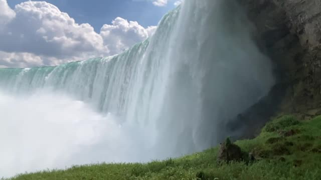
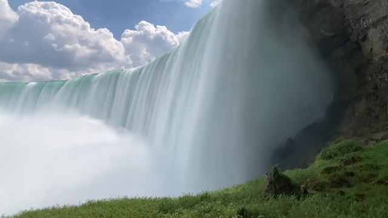
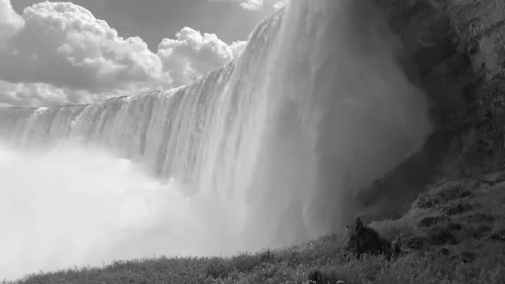
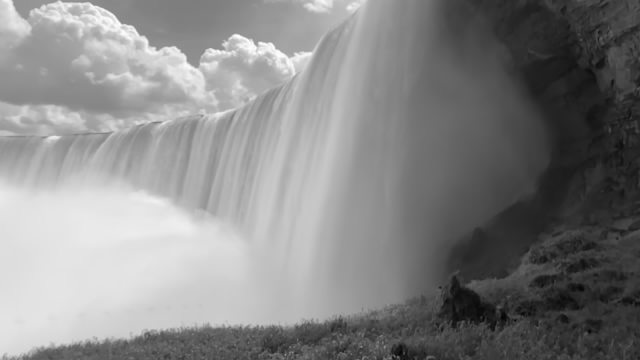

# Tutorial 1: Creating the misty water effect

Date: Sept. 8th, 2022  

This is the student template that will be populated as we implement our code.
Our results will be the images seen in the main README.md
Prior to running our implementation, our results are black placeholders. You should not need to 
modify this readme. 

In each section below, there will also be some discussion questions for the student to complete.

## A.1: Read/Write images in OpenCV
Follow the steps in the README. Once completed properly, an example original
image (coloured) will show up here.

**Questions**
1. What's the datatype of the data we read in with our function `read_im()`?  
2. What are the image dimensions (N, M) of the data we are working with? How can you tell?  
3. We're working with coloured images. Which dimension/index does red correspond to? How about green?

## A.2: Averaging over stack of images
Follow the steps in the README. Once completed properly, the final misty effect image
(coloured) will show up here.

**Question**: Which dimension should be be averaging over?

## B: Repeating A.1 and A.2 for greyscale
Original image (greyscale):

Misty image (greyscale):

**Question**: What's is the value of c for our greyscale stack with shape (K, N, M, c)?
